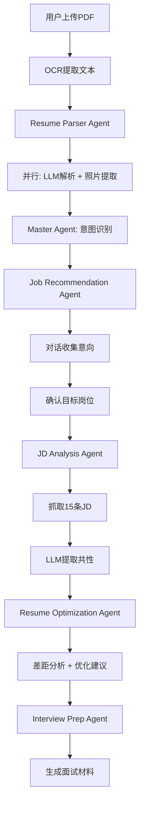

# Agent系统实现总结

## 🎯 核心目标

基于LLM构建智能Agent系统，实现简历优化全流程自动化，重点加强：
1. ✅ 使用LLM进行简历信息提取和理解
2. ✅ 采用API Key方式调用（主要使用Qwen）
3. ✅ 完善安全性管理
4. ✅ 意图识别和流程控制

## 📦 已完成的组件

### 1. 核心Agent框架

#### Base Agent (`apps/api/app/agents/base_agent.py`)
- ✅ Agent基类定义
- ✅ 统一的LLM调用接口
- ✅ AgentContext上下文管理
- ✅ StateMachine状态机
- ✅ JourneyStage流程阶段枚举

#### LLM Service (`apps/api/app/agents/llm_service.py`)
- ✅ 统一的LLM调用服务
- ✅ 支持多提供者（Qwen/DeepSeek/OpenAI）
- ✅ 自动重试机制
- ✅ 错误处理
- ✅ JSON格式响应支持

### 2. Master Agent (`apps/api/app/agents/master_agent.py`)

**职责：总控、意图识别、流程编排**

✅ 核心功能：
- 意图识别（使用LLM理解用户输入）
- 流程状态管理
- Agent调度和协调
- 路由分发

✅ 支持的操作：
- `upload_resume` - 处理简历上传
- `start_intent_collection` - 开始意图收集
- `chat` - 对话交互
- `confirm_target` - 确认目标岗位
- `analyze_jd` - JD分析
- `optimize_resume` - 简历优化

### 3. Resume Parser Agent (`apps/api/app/agents/resume_parser_agent.py`)

**职责：使用LLM从OCR文本提取结构化信息**

✅ 核心功能：
- OCR后立即使用LLM解析
- 并行处理：文本解析 + 照片提取
- 结构化输出（基本信息、教育、工作、技能、项目）
- 智能分析（经验年限、职业阶段、优势、建议岗位）

✅ 输出格式：
```json
{
  "basic_info": {...},
  "education": [...],
  "work_experience": [...],
  "projects": [...],
  "skills": {...},
  "analysis": {...}
}
```

### 4. 其他Sub-Agents（框架已就绪）

已定义但需要完整实现：
- Job Recommendation Agent
- JD Analysis Agent  
- Resume Optimization Agent
- Interview Prep Agent

### 5. 安全配置系统

#### Config Management (`apps/api/app/config.py`)
✅ 完整的配置管理：
- 使用`pydantic-settings`
- `SecretStr`保护敏感信息
- 环境变量加载
- 配置验证
- API Key屏蔽工具
- 安全日志记录器

✅ 配置项：
```python
- qwen_api_key: SecretStr
- deepseek_api_key: SecretStr
- openai_api_key: SecretStr
- default_llm_provider: str
- llm_timeout: int
- llm_max_retries: int
- mask_sensitive_data: bool
```

#### 环境配置模板 (`.env.example`)
✅ 详细的配置说明
✅ 安全注意事项
✅ 获取API Key的指引

### 6. 安全工具集

#### 验证工具 (`apps/api/app/scripts/validate_config.py`)
```bash
python -m app.scripts.validate_config
```
✅ 检查API Key配置
✅ 验证LLM提供者
✅ 安全配置检查
✅ 屏蔽敏感信息显示

#### 安全检查 (`apps/api/app/scripts/security_check.py`)
```bash
python -m app.scripts.security_check
```
✅ 扫描硬编码密钥
✅ 检查.gitignore配置
✅ 验证.env文件权限
✅ 依赖版本检查

### 7. 文档体系

✅ **架构文档** (`apps/api/app/agents/agent_architecture.md`)
- Agent层级结构
- 数据流转
- LLM Prompt模板
- 状态机设计

✅ **安全文档** (`apps/api/SECURITY.md`)
- API Key管理
- 环境变量保护
- 日志安全
- 应急响应

✅ **快速启动** (`apps/api/QUICK_START_AGENT.md`)
- 5分钟快速开始
- 配置步骤
- 测试示例
- 常见问题

## 🔐 安全特性

### 1. API Key保护

```python
# ✅ 使用SecretStr
qwen_api_key: SecretStr = Field(...)

# ✅ 安全获取
def get_qwen_api_key(self) -> Optional[str]:
    if self.qwen_api_key:
        return self.qwen_api_key.get_secret_value()
    return None
```

### 2. 日志屏蔽

```python
# ✅ 自动屏蔽敏感信息
logger.info(f"Qwen API key已配置: {settings.mask_api_key(key)}")
# 输出: "Qwen API key已配置: sk-ab...xy"

# ✅ SecureLogger
SecureLogger.safe_log(logger, "info", "Config loaded", data)
```

### 3. 环境变量隔离

```bash
# ✅ .env 文件不入库
echo ".env" >> .gitignore

# ✅ 文件权限保护（Linux/Mac）
chmod 600 .env
```

### 4. 配置验证

```python
# ✅ 启动前验证
if not settings.validate_llm_config():
    logger.warning("LLM配置不完整")
```

## 🔄 工作流程



## 📊 LLM使用策略

### 1. Resume Parser
- **提供者**: Qwen
- **温度**: 0.3（低温度保证准确性）
- **作用**: 结构化提取信息
- **输入**: OCR文本
- **输出**: JSON格式简历数据

### 2. Master Agent (意图识别)
- **提供者**: Qwen
- **温度**: 0.3（准确理解意图）
- **作用**: 识别用户意图，决定调用哪个Agent
- **输入**: 用户输入 + 当前状态
- **输出**: Agent名称 + 参数

### 3. Job Recommendation
- **提供者**: Qwen
- **温度**: 0.7（自然对话）
- **作用**: 生成引导问题，推荐岗位
- **输入**: 简历分析 + 对话历史
- **输出**: 问题 + 建议选项

### 4. JD Analysis
- **提供者**: Qwen
- **温度**: 0.5（平衡创造性和准确性）
- **作用**: 从15条JD提取共性
- **输入**: 15条JD文本
- **输出**: 4-5条核心维度

### 5. Resume Optimization
- **提供者**: Qwen
- **温度**: 0.7（生成优化建议）
- **作用**: 差距分析、生成三版本优化
- **输入**: 简历 + 共性维度
- **输出**: 差距分析 + 优化建议

## 💰 成本控制

### 1. 缓存策略
```python
# 缓存简历解析结果
context.set("resume_data", parsed_data)

# 避免重复调用LLM
if context.get("resume_data"):
    return context.get("resume_data")
```

### 2. 批量处理
```python
# 一次调用处理多个任务
result = await llm_service.complete(
    prompt=multi_task_prompt
)
```

### 3. 监控和告警
```python
# 记录每次调用
logger.info(f"LLM调用: {provider}, tokens: {tokens}")

# 设置预算告警（在阿里云控制台）
```

## 🔧 配置示例

### 开发环境
```bash
# .env
QWEN_API_KEY=sk-your-dev-key
DEFAULT_LLM_PROVIDER=qwen
DEBUG=true
LOG_LEVEL=DEBUG
MASK_SENSITIVE_DATA=true
```

### 生产环境
```bash
# .env.production
QWEN_API_KEY=sk-your-prod-key
DEFAULT_LLM_PROVIDER=qwen
DEBUG=false
LOG_LEVEL=INFO
MASK_SENSITIVE_DATA=true
SECRET_KEY=<strong-random-32-char>
ALLOWED_ORIGINS=https://yourdomain.com
```

## 📈 性能优化

### 1. 并行处理
```python
# Resume Parser中并行处理
parse_task = self._parse_resume_with_llm(ocr_text)
photo_task = self._extract_photo(pdf_bytes)
resume_data, photo_info = await asyncio.gather(
    parse_task, photo_task
)
```

### 2. 流式响应（待实现）
```python
# 使用流式API获得更快的首字节响应
async for chunk in llm_service.stream(prompt):
    yield chunk
```

### 3. 上下文复用
```python
# 复用AgentContext，避免重复加载
context = get_or_create_context(user_id, journey_id)
```

## 🚀 快速开始

```bash
# 1. 安装依赖
cd apps/api
pip install -r requirements.txt

# 2. 配置API Key
cp .env.example .env
# 编辑 .env，填入 QWEN_API_KEY

# 3. 验证配置
python -m app.scripts.validate_config

# 4. 运行安全检查
python -m app.scripts.security_check

# 5. 启动服务
uvicorn app.main:app --reload
```

## 📋 待完成任务

### P0 - 核心功能
- [ ] 完整实现所有Sub-Agents
- [ ] 创建统一的API路由
- [ ] 添加会话管理
- [ ] 实现完整的状态持久化

### P1 - 优化提升
- [ ] 添加流式响应支持
- [ ] 实现结果缓存
- [ ] 添加请求队列
- [ ] 完善错误重试机制

### P2 - 监控运维
- [ ] LLM调用监控
- [ ] 成本统计和告警
- [ ] 性能指标采集
- [ ] 日志聚合分析

## 🎓 学习资源

- [LangChain文档](https://python.langchain.com/)
- [通义千问API文档](https://help.aliyun.com/zh/dashscope/)
- [Pydantic Settings](https://docs.pydantic.dev/latest/concepts/pydantic_settings/)
- [OWASP安全指南](https://owasp.org/)

## 📞 技术支持

- **配置问题**: 查看 `QUICK_START_AGENT.md`
- **安全问题**: 查看 `SECURITY.md`
- **架构问题**: 查看 `agents/agent_architecture.md`

---

**总结**: 我们已经建立了一个安全、可扩展的Agent系统框架，使用LLM作为智能核心，通过Qwen API进行调用，并实现了完善的安全管理机制。系统支持从简历解析到面试准备的全流程自动化。

